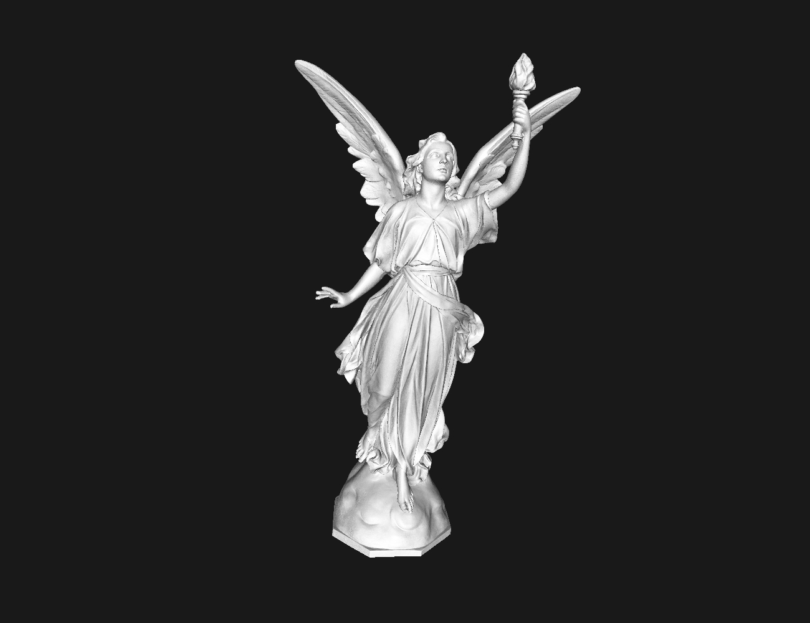
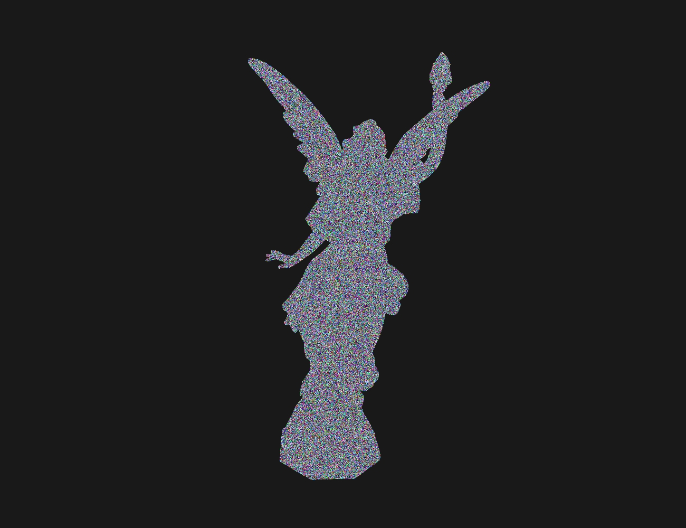
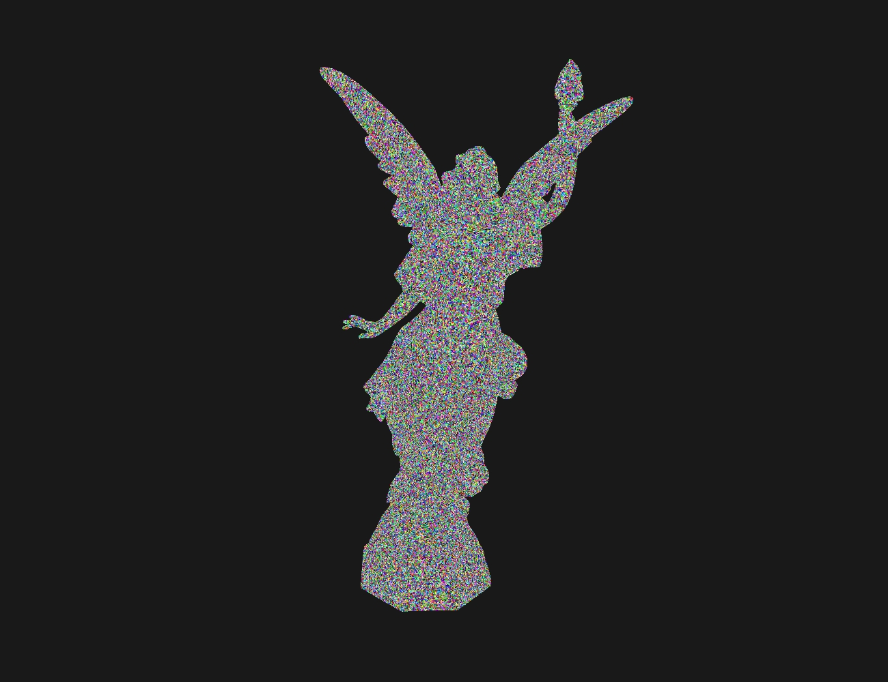
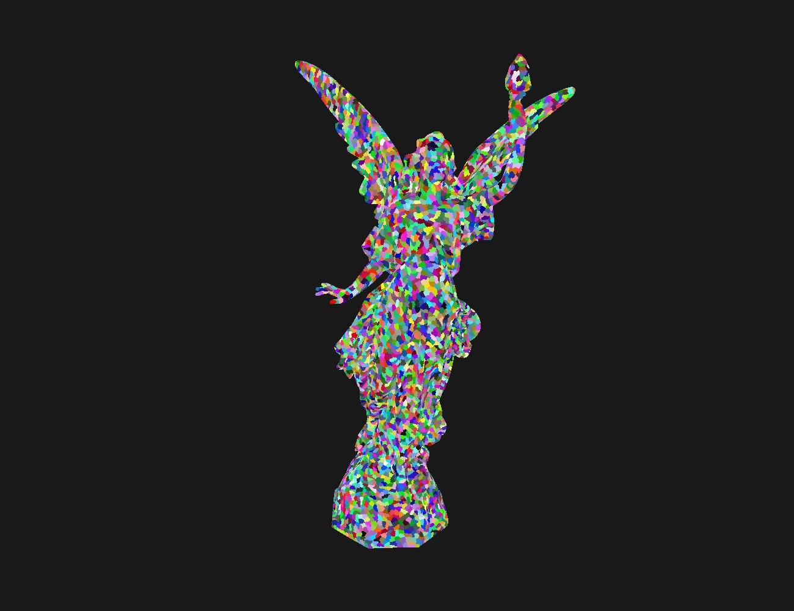

# Learn Cluster Based Structure

### Introduction

Here's a demo of the cluster-based structure I'm learning about in Nanite.

**debugLodApplication** is used to test whether the LoD of the model is generated correctly.

**application** is the complete cluster-based application that dynamically adjusts LoD with camera distance and combines cone culling and Hiz culling for optimization.

Graphics API is using vulkan 1.3.

### Demo

Lucy : 28055742 triangles

|     |      |
| ----------------------------------------- | ------------------------------------- |
|  |  |

